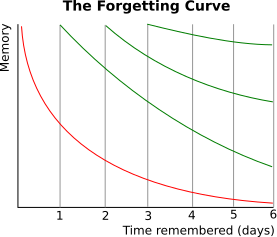
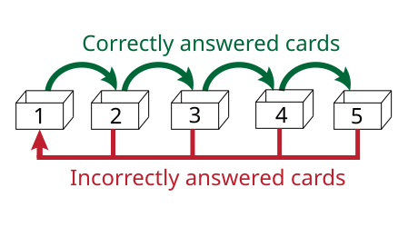

# Flashcards prontos para o Anki

Transforme notas em flashcards de qualidade, com base em ciencia cognitiva. Este repo existe para reduzir o trabalho chato de criar bons cards e acelerar sua aprendizagem com repeticao espacada.

## Por que funciona (versao tecnica)

A memoria humana sofre decaimento ao longo do tempo quando nao ha revisao. A curva do esquecimento, descrita por Hermann Ebbinghaus, caracteriza essa perda de informacao e motivou a ideia de revisar em momentos estrategicos.

Dois efeitos robustos sustentam a repeticao espacada:

### 1) Spacing effect (pratica distribuida)

Revisoes espaçadas superam revisoes concentradas (massed practice). A meta-analise classica de Cepeda et al. (2006) sintetiza centenas de estudos e mostra que a distribuicao temporal melhora a retencao. Um resultado central e que o intervalo ideal entre revisoes (ISI) aumenta conforme o intervalo ate o teste final aumenta. Ou seja, quanto maior o prazo ate a avaliacao, mais espaçado deve ser o estudo.

### 2) Testing effect (recuperacao ativa)

Testar-se (recuperar ativamente) melhora a retencao de longo prazo mais do que apenas reler, mesmo quando a releitura aumenta a confianca imediata. Em estudos com atrasos de dias a semanas, testes anteriores produzem retencao superior em comparacao a releitura repetida.

### 3) Otimizacao de intervalos

Estudos posteriores mapearam o espacamento ao longo de semanas e meses, mostrando que existe um "ridgeline" temporal: intervalos muito curtos desperdicam esforco, e intervalos muito longos deixam a informacao se perder antes da revisao. O melhor intervalo depende do tempo ate a prova, reforcando a ideia de espacamento adaptativo.



O metodo de Leitner operacionaliza esses efeitos com simplicidade: cards corretos avancam para caixas com intervalos maiores; cards errados voltam para revisoes frequentes.



### Implicacoes praticas para flashcards

- **Um card = um conceito**: facilita recuperacao ativa.
- **Respostas curtas**: minimiza carga cognitiva e evita ambiguidades.
- **Tags**: permitem organizar revisoes por tema e prioridade.
- **Revisao em ciclos**: aumenta o espaçamento conforme a lembranca estabiliza.

Referencias principais:
- [Hermann Ebbinghaus e a curva do esquecimento (Britannica)](https://www.britannica.com/biography/Hermann-Ebbinghaus)
- [Meta-analise do spacing effect (Psychological Bulletin, 2006)](https://pubmed.ncbi.nlm.nih.gov/16719566/)
- [Testing effect: test-enhanced learning (Psychological Science, 2006)](https://pubmed.ncbi.nlm.nih.gov/16507066/)
- [Otimizacao de intervalos (Psychological Science, 2008)](https://pubmed.ncbi.nlm.nih.gov/19076480/)
- [Metodo de Leitner](https://en.wikipedia.org/wiki/Leitner_system)

## Evidencias e limites

Spaced repetition e robusta, mas nao e uma formula magica. A meta-analise de pratica distribuida mostra que o ganho depende do intervalo entre sessoes e do tempo ate o teste final: intervalos muito curtos ou muito longos reduzem a eficiencia. Estudos posteriores mostram a mesma relacao em prazos longos (semanas a meses), sugerindo que o espacamento deve ser ajustado ao horizonte de retencao.

O testing effect tambem tem limites: recuperar ativamente pode parecer mais dificil e pode reduzir a confianca imediata, mesmo quando melhora a retencao no longo prazo. Isso implica que o usuario pode sentir que esta \"indo pior\" no curto prazo, quando na verdade esta aprendendo mais.

Na pratica, flashcards sao excelentes para fatos, definicoes, formulas e discriminacoes simples. Para habilidades complexas, eles ajudam na base conceitual, mas nao substituem pratica deliberada (resolver problemas, escrever, programar, etc.). Use flashcards como camada de memoria, nao como unica estrategia.

## O problema real

Spaced repetition funciona, mas criar bons flashcards e dificil. Cards ruins geram revisoes ineficientes: perguntas vagas, respostas longas e sem tags. Esse repo resolve isso com prompts que orientam a criacao de cards claros, objetivos e prontos para o Anki.

## O que este repo oferece

- Prompts detalhados para gerar flashcards no formato TSV do Anki
- Prompt resumido para uso rapido (modo CLI)
- Prompt para uso direto em chat web (sem caminho de arquivo)
- Exemplo completo (entrada .md e saida .tsv)
- Materiais visuais para explicar o metodo

## Como usar

**Escolha seu modo**
- **CLI / arquivo local:** use `prompts/anki_prompt_completo.md` (ou `prompts/anki_prompt_resumido.md`) e informe o caminho do arquivo
- **Web / chat:** use `prompts/anki_prompt_web.md` e cole o conteudo no chat ou anexe o arquivo

1. Prepare um arquivo de notas em `.md` ou `.txt`
2. Escolha o prompt em `prompts/`
3. Cole o prompt em um LLM
4. Siga o modo escolhido (caminho do arquivo ou conteudo colado/anexado)
5. Gere o arquivo `.tsv` e importe no Anki

Prompts disponiveis:
- `prompts/anki_prompt_completo.md` (modo CLI)
- `prompts/anki_prompt_resumido.md` (modo CLI)
- `prompts/anki_prompt_web.md`

## Exemplo completo

Entrada (trecho):

```md
## Conta-corrente
A conta-corrente e o tipo de conta mais comum e a mais completa oferecida pelos bancos.

## Conta-salario
E de responsabilidade do empregador realizar a abertura desse tipo de conta.
```

Saida (trecho TSV):

```tsv
O que e conta-corrente?	E o tipo de conta mais comum e completa oferecida pelos bancos, aberta por qualquer pessoa para receber pagamentos, pagar contas, fazer transferencias, ter cartao de credito e cheque, e sacar dinheiro.	#conta-corrente #conceitos
Quem e responsavel pela abertura de uma conta-salario?	O empregador - empresa ou orgao publico.	#conta-salario #conceitos
```

Arquivos completos do exemplo:
- `examples/servicos_bancarios.md`
- `examples/flashcards_servicos_bancarios.tsv`

## Importar no Anki (checklist rapido)

- Tipo: texto separado por tabulacoes
- Campo 1 -> Frente
- Campo 2 -> Verso
- Campo 3 -> Tags

## Estrutura do repo

- `assets/` imagens usadas no README
- `prompts/` prompts de geracao de flashcards
- `examples/` exemplo completo de entrada e saida
- `docs/` notas curtas e explicacoes
- `archive/` materiais de referencia antigos (nao usados no README)

## Referencias (artigos e fontes)

- Ebbinghaus, H. (2013, reimp.). *Memory: A Contribution to Experimental Psychology*. Annals of Neurosciences. https://doi.org/10.5214/ans.0972.7531.200408
- Cepeda, N. J., Pashler, H., Vul, E., Wixted, J. T., & Rohrer, D. (2006). *Distributed practice in verbal recall tasks: A review and quantitative synthesis*. Psychological Bulletin. https://doi.org/10.1037/0033-2909.132.3.354
- Roediger, H. L., & Karpicke, J. D. (2006). *Test-enhanced learning: Taking memory tests improves long-term retention*. Psychological Science. https://doi.org/10.1111/j.1467-9280.2006.01693.x
- Cepeda, N. J., Vul, E., Rohrer, D., Wixted, J. T., & Pashler, H. (2008). *Spacing effects in learning: A temporal ridgeline of optimal retention*. Psychological Science. https://doi.org/10.1111/j.1467-9280.2008.02209.x
- *Metodo de Leitner* (visao geral). https://en.wikipedia.org/wiki/Leitner_system
